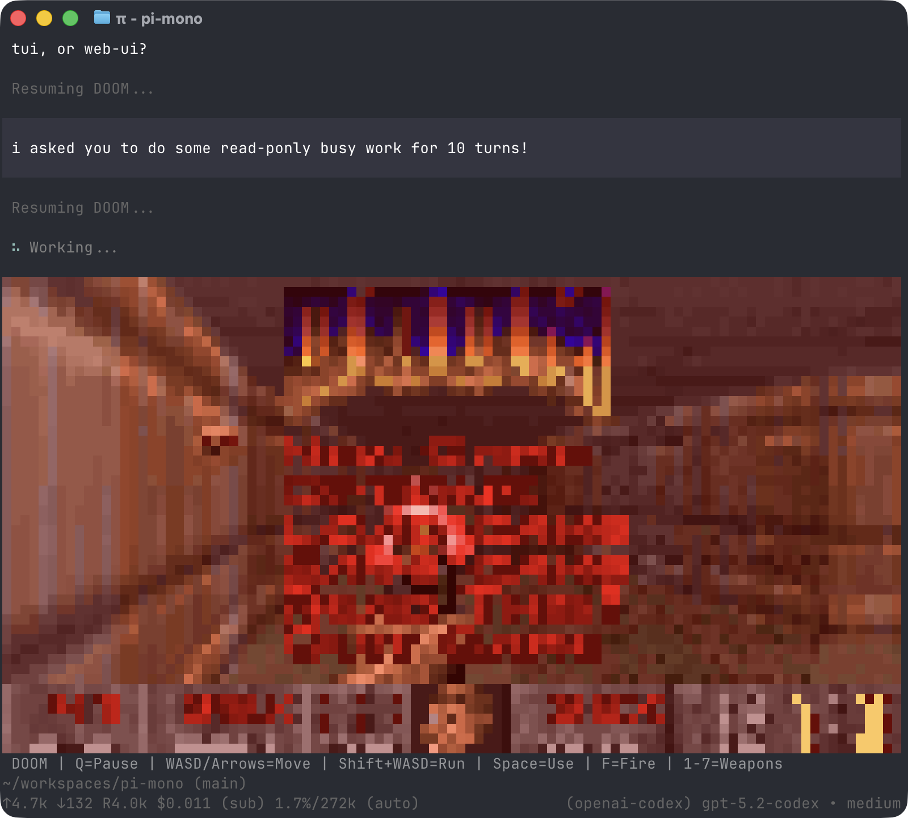

<p align="center">
  <a href="https://shittycodingagent.ai">
    
  </a>
</p>
<p align="center">
  <a href="https://discord.com/invite/3cU7Bz4UPx"></a>
  <a href="https://www.npmjs.com/package/@mariozechner/companion-coding-agent"></a>
  <a href="https://github.com/getcompanion-ai/co-mono/actions/workflows/ci.yml"></a>
</p>
<p align="center">
  <a href="https://companion.dev">companion.dev</a> domain graciously donated by
  <br /><br />
  <a href="https://exe.dev"><br />exe.dev</a>
</p>

Companion is a minimal terminal coding harness. Adapt companion to your workflows, not the other way around, without having to fork and modify companion internals. Extend it with TypeScript [Extensions](#extensions), [Skills](#skills), [Prompt Templates](#prompt-templates), and [Themes](#themes). Put your extensions, skills, prompt templates, and themes in [Companion Packages](#companion-packages) and share them with others via npm or git.

Companion ships with powerful defaults but skips features like sub agents and plan mode. Instead, you can ask companion to build what you want or install a third party companion package that matches your workflow.

Companion runs in four modes: interactive, print or JSON, RPC for process integration, and an SDK for embedding in your own apps. See [openclaw/openclaw](https://github.com/openclaw/openclaw) for a real-world SDK integration.

## Table of Contents

- [Quick Start](#quick-start)
- [Providers & Models](#providers--models)
- [Interactive Mode](#interactive-mode)
  - [Editor](#editor)
  - [Commands](#commands)
  - [Keyboard Shortcuts](#keyboard-shortcuts)
  - [Message Queue](#message-queue)
- [Sessions](#sessions)
  - [Branching](#branching)
  - [Compaction](#compaction)
- [Settings](#settings)
- [Context Files](#context-files)
- [Customization](#customization)
  - [Prompt Templates](#prompt-templates)
  - [Skills](#skills)
  - [Extensions](#extensions)
  - [Themes](#themes)
  - [Companion Packages](#companion-packages)
- [Programmatic Usage](#programmatic-usage)
- [Philosophy](#philosophy)
- [CLI Reference](#cli-reference)

---

## Quick Start

```bash
npm install -g @mariozechner/companion-coding-agent
```

Authenticate with an API key:

```bash
export ANTHROPIC_API_KEY=sk-ant-...
companion
```

Or use your existing subscription:

```bash
companion
/login  # Then select provider
```

Then just talk to companion. By default, companion gives the model four tools: `read`, `write`, `edit`, and `bash`. The model uses these to fulfill your requests. Add capabilities via [skills](#skills), [prompt templates](#prompt-templates), [extensions](#extensions), or [companion packages](#companion-packages).

**Platform notes:** [Windows](docs/windows.md) | [Termux (Android)](docs/termux.md) | [Terminal setup](docs/terminal-setup.md) | [Shell aliases](docs/shell-aliases.md)

---

## Providers & Models

For each built-in provider, companion maintains a list of tool-capable models, updated with every release. Authenticate via subscription (`/login`) or API key, then select any model from that provider via `/model` (or Ctrl+L).

**Subscriptions:**

- Anthropic Claude Pro/Max
- OpenAI ChatGPT Plus/Pro (Codex)
- GitHub Copilot
- Google Gemini CLI
- Google Antigravity

**API keys:**

- Anthropic
- OpenAI
- Azure OpenAI
- Google Gemini
- Google Vertex
- Amazon Bedrock
- Mistral
- Groq
- Cerebras
- xAI
- OpenRouter
- Vercel AI Gateway
- ZAI
- OpenCode Zen
- OpenCode Go
- Hugging Face
- Kimi For Coding
- MiniMax

See [docs/providers.md](docs/providers.md) for detailed setup instructions.

**Custom providers & models:** Add providers via `~/.companion/agent/models.json` if they speak a supported API (OpenAI, Anthropic, Google). For custom APIs or OAuth, use extensions. See [docs/models.md](docs/models.md) and [docs/custom-provider.md](docs/custom-provider.md).

---

## Interactive Mode

<p align="center"></p>

The interface from top to bottom:

- **Startup header** - Shows shortcuts (`/hotkeys` for all), loaded AGENTS.md files, prompt templates, skills, and extensions
- **Messages** - Your messages, assistant responses, tool calls and results, notifications, errors, and extension UI
- **Editor** - Where you type; border color indicates thinking level
- **Footer** - Working directory, session name, total token/cache usage, cost, context usage, current model

The editor can be temporarily replaced by other UI, like built-in `/settings` or custom UI from extensions (e.g., a Q&A tool that lets the user answer model questions in a structured format). [Extensions](#extensions) can also replace the editor, add widgets above/below it, a status line, custom footer, or overlays.

### Editor

| Feature         | How                                                                       |
| --------------- | ------------------------------------------------------------------------- |
| File reference  | Type `@` to fuzzy-search project files                                    |
| Path completion | Tab to complete paths                                                     |
| Multi-line      | Shift+Enter (or Ctrl+Enter on Windows Terminal)                           |
| Images          | Ctrl+V to paste (Alt+V on Windows), or drag onto terminal                 |
| Bash commands   | `!command` runs and sends output to LLM, `!!command` runs without sending |

Standard editing keybindings for delete word, undo, etc. See [docs/keybindings.md](docs/keybindings.md).

### Commands

Type `/` in the editor to trigger commands. [Extensions](#extensions) can register custom commands, [skills](#skills) are available as `/skill:name`, and [prompt templates](#prompt-templates) expand via `/templatename`.

| Command             | Description                                                                         |
| ------------------- | ----------------------------------------------------------------------------------- |
| `/login`, `/logout` | OAuth authentication                                                                |
| `/model`            | Switch models                                                                       |
| `/scoped-models`    | Enable/disable models for Ctrl+P cycling                                            |
| `/settings`         | Thinking level, theme, message delivery, transport                                  |
| `/resume`           | Pick from previous sessions                                                         |
| `/new`              | Start a new session                                                                 |
| `/name <name>`      | Set session display name                                                            |
| `/session`          | Show session info (path, tokens, cost)                                              |
| `/tree`             | Jump to any point in the session and continue from there                            |
| `/fork`             | Create a new session from the current branch                                        |
| `/compact [prompt]` | Manually compact context, optional custom instructions                              |
| `/copy`             | Copy last assistant message to clipboard                                            |
| `/export [file]`    | Export session to HTML file                                                         |
| `/share`            | Upload as private GitHub gist with shareable HTML link                              |
| `/reload`           | Reload extensions, skills, prompts, context files (themes hot-reload automatically) |
| `/hotkeys`          | Show all keyboard shortcuts                                                         |
| `/changelog`        | Display version history                                                             |
| `/quit`, `/exit`    | Quit companion                                                                             |

### Keyboard Shortcuts

See `/hotkeys` for the full list. Customize via `~/.companion/agent/keybindings.json`. See [docs/keybindings.md](docs/keybindings.md).

**Commonly used:**

| Key                   | Action                               |
| --------------------- | ------------------------------------ |
| Ctrl+C                | Clear editor                         |
| Ctrl+C twice          | Quit                                 |
| Escape                | Cancel/abort                         |
| Escape twice          | Open `/tree`                         |
| Ctrl+L                | Open model selector                  |
| Ctrl+P / Shift+Ctrl+P | Cycle scoped models forward/backward |
| Shift+Tab             | Cycle thinking level                 |
| Ctrl+O                | Collapse/expand tool output          |
| Ctrl+T                | Collapse/expand thinking blocks      |

### Message Queue

Submit messages while the agent is working:

- **Enter** queues a _steering_ message, delivered after current tool execution (interrupts remaining tools)
- **Alt+Enter** queues a _follow-up_ message, delivered only after the agent finishes all work
- **Escape** aborts and restores queued messages to editor
- **Alt+Up** retrieves queued messages back to editor

Configure delivery in [settings](docs/settings.md): `steeringMode` and `followUpMode` can be `"one-at-a-time"` (default, waits for response) or `"all"` (delivers all queued at once). `transport` selects provider transport preference (`"sse"`, `"websocket"`, or `"auto"`) for providers that support multiple transports.

---

## Sessions

Sessions are stored as JSONL files with a tree structure. Each entry has an `id` and `parentId`, enabling in-place branching without creating new files. See [docs/session.md](docs/session.md) for file format.

### Management

Sessions auto-save to `~/.companion/agent/sessions/` organized by working directory.

```bash
companion -c                  # Continue most recent session
companion -r                  # Browse and select from past sessions
companion --no-session        # Ephemeral mode (don't save)
companion --session <path>    # Use specific session file or ID
```

### Branching

**`/tree`** - Navigate the session tree in-place. Select any previous point, continue from there, and switch between branches. All history preserved in a single file.

<p align="center"></p>

- Search by typing, page with ←/→
- Filter modes (Ctrl+O): default → no-tools → user-only → labeled-only → all
- Press `l` to label entries as bookmarks

**`/fork`** - Create a new session file from the current branch. Opens a selector, copies history up to the selected point, and places that message in the editor for modification.

### Compaction

Long sessions can exhaust context windows. Compaction summarizes older messages while keeping recent ones.

**Manual:** `/compact` or `/compact <custom instructions>`

**Automatic:** Enabled by default. Triggers on context overflow (recovers and retries) or when approaching the limit (proactive). Configure via `/settings` or `settings.json`.

Compaction is lossy. The full history remains in the JSONL file; use `/tree` to revisit. Customize compaction behavior via [extensions](#extensions). See [docs/compaction.md](docs/compaction.md) for internals.

---

## Settings

Use `/settings` to modify common options, or edit JSON files directly:

| Location                    | Scope                      |
| --------------------------- | -------------------------- |
| `~/.companion/agent/settings.json` | Global (all projects)      |
| `.companion/settings.json`         | Project (overrides global) |

See [docs/settings.md](docs/settings.md) for all options.

---

## Context Files

Companion loads `AGENTS.md` (or `CLAUDE.md`) at startup from:

- `~/.companion/agent/AGENTS.md` (global)
- Parent directories (walking up from cwd)
- Current directory

Use for project instructions, conventions, common commands. All matching files are concatenated.

### System Prompt

Replace the default system prompt with `.companion/SYSTEM.md` (project) or `~/.companion/agent/SYSTEM.md` (global). Append without replacing via `APPEND_SYSTEM.md`.

---

## Customization

### Prompt Templates

Reusable prompts as Markdown files. Type `/name` to expand.

```markdown
<!-- ~/.companion/agent/prompts/review.md -->

Review this code for bugs, security issues, and performance problems.
Focus on: {{focus}}
```

Place in `~/.companion/agent/prompts/`, `.companion/prompts/`, or a [companion package](#companion-packages) to share with others. See [docs/prompt-templates.md](docs/prompt-templates.md).

### Skills

On-demand capability packages following the [Agent Skills standard](https://agentskills.io). Invoke via `/skill:name` or let the agent load them automatically.

```markdown
<!-- ~/.companion/agent/skills/my-skill/SKILL.md -->

# My Skill

Use this skill when the user asks about X.

## Steps

1. Do this
2. Then that
```

Place in `~/.companion/agent/skills/`, `~/.agents/skills/`, `.companion/skills/`, or `.agents/skills/` (from `cwd` up through parent directories) or a [companion package](#companion-packages) to share with others. See [docs/skills.md](docs/skills.md).

### Extensions

<p align="center"></p>

TypeScript modules that extend companion with custom tools, commands, keyboard shortcuts, event handlers, and UI components.

```typescript
export default function (companion: ExtensionAPI) {
  companion.registerTool({ name: "deploy", ... });
  companion.registerCommand("stats", { ... });
  companion.on("tool_call", async (event, ctx) => { ... });
}
```

**What's possible:**

- Custom tools (or replace built-in tools entirely)
- Sub-agents and plan mode
- Custom compaction and summarization
- Permission gates and path protection
- Custom editors and UI components
- Status lines, headers, footers
- Git checkpointing and auto-commit
- SSH and sandbox execution
- MCP server integration
- Make companion look like Claude Code
- Games while waiting (yes, Doom runs)
- ...anything you can dream up

Place in `~/.companion/agent/extensions/`, `.companion/extensions/`, or a [companion package](#companion-packages) to share with others. See [docs/extensions.md](docs/extensions.md).

### Themes

Built-in: `dark`, `light`. Themes hot-reload: modify the active theme file and companion immediately applies changes.

Place in `~/.companion/agent/themes/`, `.companion/themes/`, or a [companion package](#companion-packages) to share with others. See [docs/themes.md](docs/themes.md).

### Companion Packages

Bundle and share extensions, skills, prompts, and themes via npm or git. Find packages on [npmjs.com](https://www.npmjs.com/search?q=keywords%3Acompanion-package) or [Discord](https://discord.com/channels/1456806362351669492/1457744485428629628).

> **Security:** Companion packages run with full system access. Extensions execute arbitrary code, and skills can instruct the model to perform any action including running executables. Review source code before installing third-party packages.

```bash
companion install npm:@foo/companion-tools
companion install npm:@foo/companion-tools@1.2.3      # pinned version
companion install git:github.com/user/repo
companion install git:github.com/user/repo@v1  # tag or commit
companion install git:git@github.com:user/repo
companion install git:git@github.com:user/repo@v1  # tag or commit
companion install https://github.com/user/repo
companion install https://github.com/user/repo@v1      # tag or commit
companion install ssh://git@github.com/user/repo
companion install ssh://git@github.com/user/repo@v1    # tag or commit
companion remove npm:@foo/companion-tools
companion list
companion update                               # skips pinned packages
companion config                               # enable/disable extensions, skills, prompts, themes
```

Packages install to `~/.companion/agent/git/` (git) or global npm. Use `-l` for project-local installs (`.companion/git/`, `.companion/npm/`).

Create a package by adding a `companion` key to `package.json`:

```json
{
  "name": "my-companion-package",
  "keywords": ["companion-package"],
  "companion": {
    "extensions": ["./extensions"],
    "skills": ["./skills"],
    "prompts": ["./prompts"],
    "themes": ["./themes"]
  }
}
```

Without a `companion` manifest, companion auto-discovers from conventional directories (`extensions/`, `skills/`, `prompts/`, `themes/`).

See [docs/packages.md](docs/packages.md).

---

## Programmatic Usage

### SDK

```typescript
import {
  AuthStorage,
  createAgentSession,
  ModelRegistry,
  SessionManager,
} from "@mariozechner/companion-coding-agent";

const { session } = await createAgentSession({
  sessionManager: SessionManager.inMemory(),
  authStorage: AuthStorage.create(),
  modelRegistry: new ModelRegistry(authStorage),
});

await session.prompt("What files are in the current directory?");
```

See [docs/sdk.md](docs/sdk.md).

### RPC Mode

For non-Node.js integrations, use RPC mode over stdin/stdout:

```bash
companion --mode rpc
```

See [docs/rpc.md](docs/rpc.md) for the protocol.

---

## Philosophy

Companion is aggressively extensible so it doesn't have to dictate your workflow. Features that other tools bake in can be built with [extensions](#extensions), [skills](#skills), or installed from third-party [companion packages](#companion-packages). This keeps the core minimal while letting you shape companion to fit how you work.

**No MCP.** Build CLI tools with READMEs (see [Skills](#skills)), or build an extension that adds MCP support. [Why?](https://mariozechner.at/posts/2025-11-02-what-if-you-dont-need-mcp/)

**No sub-agents.** There's many ways to do this. Spawn companion instances via tmux, or build your own with [extensions](#extensions), or install a package that does it your way.

**No permission popups.** Run in a container, or build your own confirmation flow with [extensions](#extensions) inline with your environment and security requirements.

**No plan mode.** Write plans to files, or build it with [extensions](#extensions), or install a package.

**No built-in to-dos.** They confuse models. Use a TODO.md file, or build your own with [extensions](#extensions).

**No background bash.** Use tmux. Full observability, direct interaction.

Read the [blog post](https://mariozechner.at/posts/2025-11-30-companion-coding-agent/) for the full rationale.

---

## CLI Reference

```bash
companion [options] [@files...] [messages...]
```

### Package Commands

```bash
companion install <source> [-l]    # Install package, -l for project-local
companion remove <source> [-l]     # Remove package
companion update [source]          # Update packages (skips pinned)
companion list                     # List installed packages
companion config                   # Enable/disable package resources
```

### Modes

| Flag                  | Description                                                              |
| --------------------- | ------------------------------------------------------------------------ |
| (default)             | Interactive mode                                                         |
| `-p`, `--print`       | Print response and exit                                                  |
| `daemon`              | Start a long-lived, non-interactive daemon that keeps extensions running |
| `--mode json`         | Output all events as JSON lines (see [docs/json.md](docs/json.md))       |
| `--mode rpc`          | RPC mode for process integration (see [docs/rpc.md](docs/rpc.md))        |
| `--export <in> [out]` | Export session to HTML                                                   |

### Model Options

| Option                   | Description                                                             |
| ------------------------ | ----------------------------------------------------------------------- |
| `--provider <name>`      | Provider (anthropic, openai, google, etc.)                              |
| `--model <pattern>`      | Model pattern or ID (supports `provider/id` and optional `:<thinking>`) |
| `--api-key <key>`        | API key (overrides env vars)                                            |
| `--thinking <level>`     | `off`, `minimal`, `low`, `medium`, `high`, `xhigh`                      |
| `--models <patterns>`    | Comma-separated patterns for Ctrl+P cycling                             |
| `--list-models [search]` | List available models                                                   |

### Session Options

| Option                | Description                               |
| --------------------- | ----------------------------------------- |
| `-c`, `--continue`    | Continue most recent session              |
| `-r`, `--resume`      | Browse and select session                 |
| `--session <path>`    | Use specific session file or partial UUID |
| `--session-dir <dir>` | Custom session storage directory          |
| `--no-session`        | Ephemeral mode (don't save)               |

### Tool Options

| Option           | Description                                                      |
| ---------------- | ---------------------------------------------------------------- |
| `--tools <list>` | Enable specific built-in tools (default: `read,bash,edit,write`) |
| `--no-tools`     | Disable all built-in tools (extension tools still work)          |

Available built-in tools: `read`, `bash`, `edit`, `write`, `grep`, `find`, `ls`

### Resource Options

| Option                       | Description                                        |
| ---------------------------- | -------------------------------------------------- |
| `-e`, `--extension <source>` | Load extension from path, npm, or git (repeatable) |
| `--no-extensions`            | Disable extension discovery                        |
| `--skill <path>`             | Load skill (repeatable)                            |
| `--no-skills`                | Disable skill discovery                            |
| `--prompt-template <path>`   | Load prompt template (repeatable)                  |
| `--no-prompt-templates`      | Disable prompt template discovery                  |
| `--theme <path>`             | Load theme (repeatable)                            |
| `--no-themes`                | Disable theme discovery                            |

Combine `--no-*` with explicit flags to load exactly what you need, ignoring settings.json (e.g., `--no-extensions -e ./my-ext.ts`).

### Other Options

| Option                          | Description                                                      |
| ------------------------------- | ---------------------------------------------------------------- |
| `--system-prompt <text>`        | Replace default prompt (context files and skills still appended) |
| `--append-system-prompt <text>` | Append to system prompt                                          |
| `--verbose`                     | Force verbose startup                                            |
| `-h`, `--help`                  | Show help                                                        |
| `-v`, `--version`               | Show version                                                     |

### File Arguments

Prefix files with `@` to include in the message:

```bash
companion @prompt.md "Answer this"
companion -p @screenshot.png "What's in this image?"
companion @code.ts @test.ts "Review these files"
```

### Examples

```bash
# Interactive with initial prompt
companion "List all .ts files in src/"

# Non-interactive
companion -p "Summarize this codebase"

# Different model
companion --provider openai --model gpt-4o "Help me refactor"

# Model with provider prefix (no --provider needed)
companion --model openai/gpt-4o "Help me refactor"

# Model with thinking level shorthand
companion --model sonnet:high "Solve this complex problem"

# Limit model cycling
companion --models "claude-*,gpt-4o"

# Read-only mode
companion --tools read,grep,find,ls -p "Review the code"

# High thinking level
companion --thinking high "Solve this complex problem"
```

### Environment Variables

| Variable                | Description                                                                        |
| ----------------------- | ---------------------------------------------------------------------------------- |
| `COMPANION_CODING_AGENT_DIR`   | Override config directory (default: `~/.companion/agent`)                                 |
| `COMPANION_PACKAGE_DIR`        | Override package directory (useful for Nix/Guix where store paths tokenize poorly) |
| `COMPANION_SKIP_VERSION_CHECK` | Skip version check at startup                                                      |
| `COMPANION_CACHE_RETENTION`    | Set to `long` for extended prompt cache (Anthropic: 1h, OpenAI: 24h)               |
| `VISUAL`, `EDITOR`      | External editor for Ctrl+G                                                         |

---

## Contributing & Development

See [CONTRIBUTING.md](../../CONTRIBUTING.md) for guidelines and [docs/development.md](docs/development.md) for setup, forking, and debugging.

---

## License

MIT

## See Also

- [@mariozechner/companion-ai](https://www.npmjs.com/package/@mariozechner/companion-ai): Core LLM toolkit
- [@mariozechner/companion-agent](https://www.npmjs.com/package/@mariozechner/companion-agent): Agent framework
- [@mariozechner/companion-tui](https://www.npmjs.com/package/@mariozechner/companion-tui): Terminal UI components
